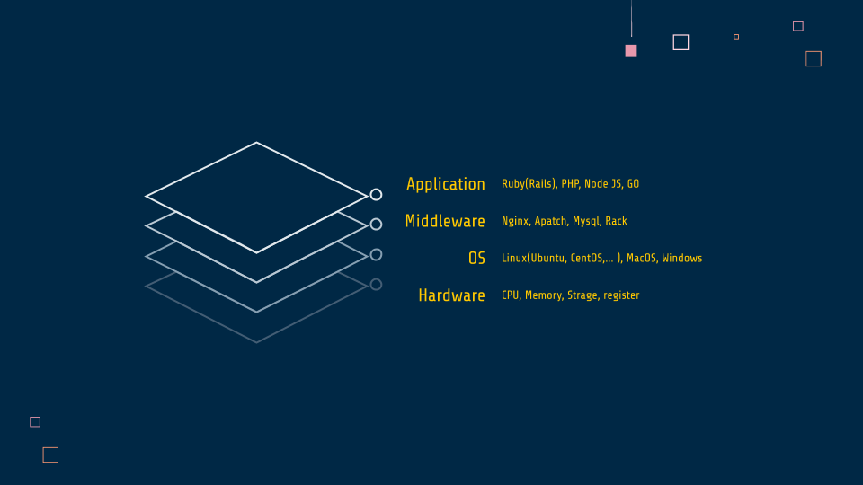

# AWS勉強会

## 
- [サーバー](#サーバー)
- [ネットワーク](#ネットワーク)
- [仮想化](#仮想化)

## サーバー

### ハードウェア
CPUやメモリ・ストレージなど

### OS
LinuxやMacOS・Windowsなど

### ミドルウェア
NginxやApatch・Mysqlなど

### アプリケーション（ソフトウェア）
Railsなど。  
実際に普段制作しているような部分。

## ネットワーク
TCP/IP

## 仮想化
クラウドやDockerなど
