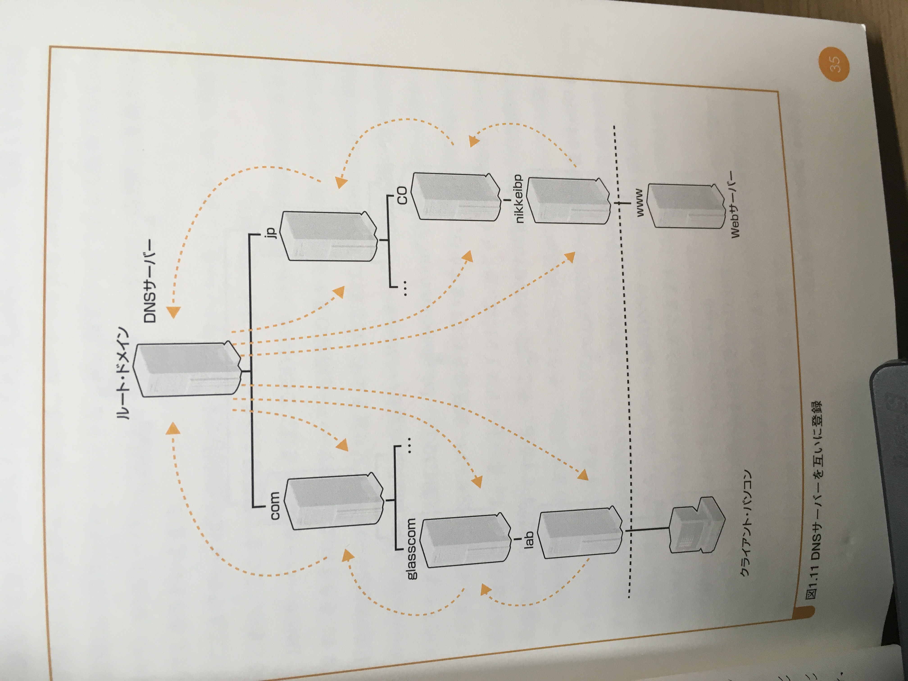
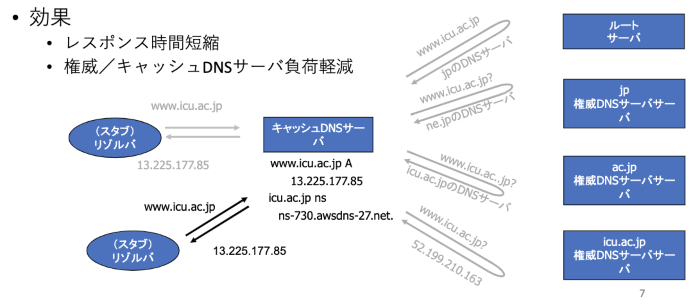

# DNS/CDNの入門

## 目次
- [DNS](#DNS)
- [CDN](#CDN)

## DNS
### DNSとは
ドメイン名からIPアドレスを解決する仕組み

### DNSの例
post-urban.social → 54.64.99.178

### DNSによる名前解決
端末(OS) 内に名前解決を担うリゾルバ(resolver) という機能があり、リゾルバが外部のDNSサーバとやりとりしてアドレスを解決

### DNSサーバーと階層構造
DNSで扱う名前はwww.post-urban.coというようにドットで区切って階層化されており、右に位置する名前が上位の階層を表す

### DNSレコード
DNSはドメイン名に対するIPv4アドレスの対応(Aレコードと呼ぶ）以外の対応も保持。

|  レコード |    |
| ---- | ---- |
|  Aレコード  |  ドメイン名→IPv4アドレス  |
|  AAAAレコード  |  ドメイン名→IPv6アドレス  |
| NSレコード | ドメイン→権威DNSサーバー|
|PTRレコード|IPv4/IPv6アドレス→ドメイン名|
|MXレコード|ドメイン→メールサーバー|
|CNAMEレコード| ドメイン名→別名|

## CDN
### CDNとは
キャッシュDNSサーバに問い合わせに対する応答レコードを一時的に記憶（キャッシュ）し二回目以降の問い合わせ（他のリゾルバからの問い合わせ含む）に対しては、ネームサーバに問い合わせをせず，自身のキャッシュを応答し、サーバーへの負荷を減らす仕組み。
最大キャッシュ時間が定められており、キャッシュ時間を過ぎるとキャッシュサーバからキャッシュを削除。

