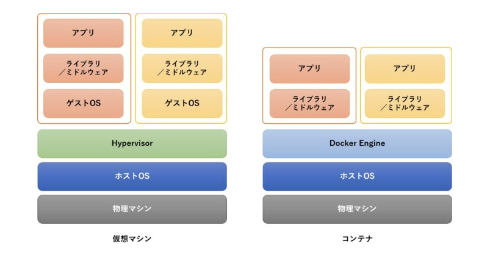

# Docker

## 目次
- [仮装マシンとの違い](#仮装マシンとの違い)

## 仮装マシンとの違い

### コンピュータ

### 仮装マシンとの違い

VirtualBoxなどの仮装マシンはOS自体を仮想化するのに対し、  
Dockerコンテナはプロセスレベルでの仮想化になる。  

### 仮想マシンの課題
1. 同じプログラムでも実行OSの違いや、ミドルウェアのバージョン違いなどによって、正常に動作しないことがある  
2. オーバーヘッドが非常に高い（OSレベルで仮想化しないといけないので非常に立ち上げコストがかかる）  
など。  

1はアプリケーション開発者がインフラ周りの知識を必要とし、非常に複雑化した問題が起きていた。  
また、2は並列化など様々な面で大きな課題となる。  

### コンテナで解決
アプリケーションの可搬性、柔軟性、拡張性、リソースの節約、プロビジョニングの簡略化、開発プロセスの単純化。

## Dockerイメージとコンテナ

### イメージ
Dockerイメージとはプロセスの状態をそのまま一枚のファイルに保存したようなもの。

### コンテナ
Dockerイメージから、保存されているプロセスを復元（再現）することが可能。  
そのプロセス一つ一つが「コンテナ」と呼ばれている。  

### Dockerfile
Dockerイメージはすでに動いているプロセス（コンテナ）をそのままファイルに保存することも可能だが、  
設計図から直接作ることも可能。  

その、Dockerイメージを作るための設計図をDockerfileと呼ぶ。  
Dockerfileはベースとなるイメージを指定し、そのイメージに付け足したい処理を書き加えていくような形となっている。  

