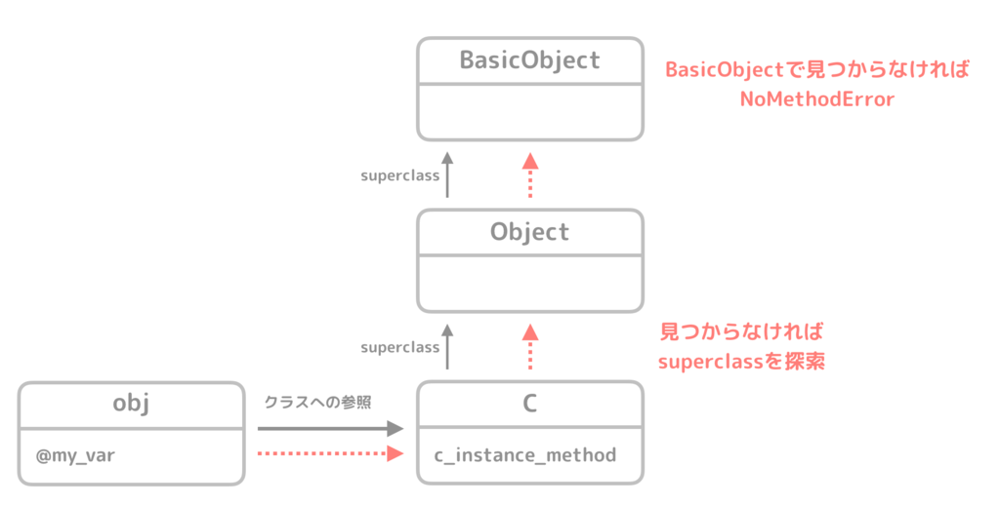
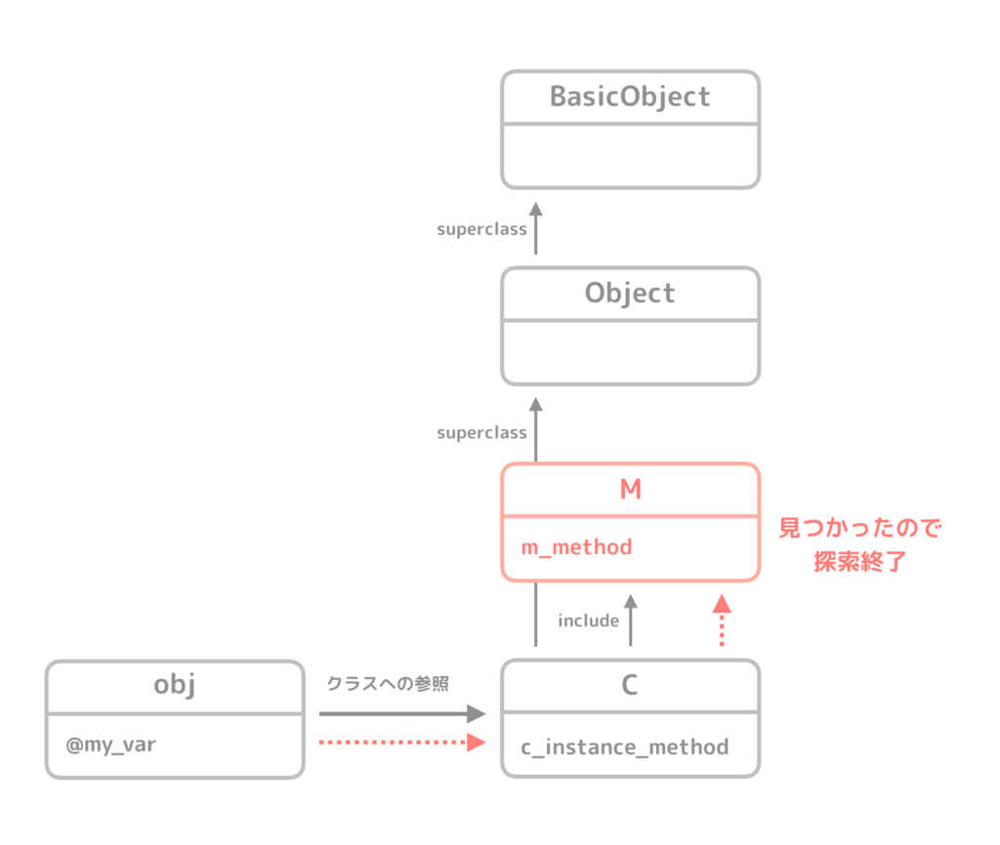
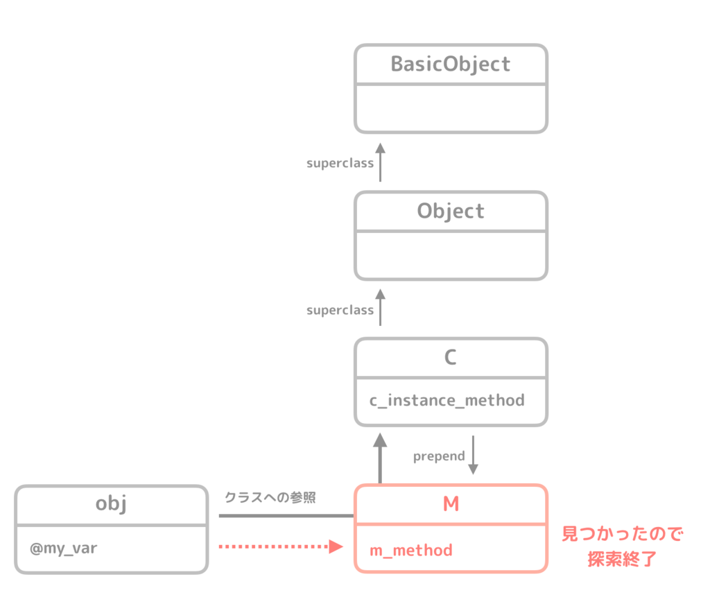
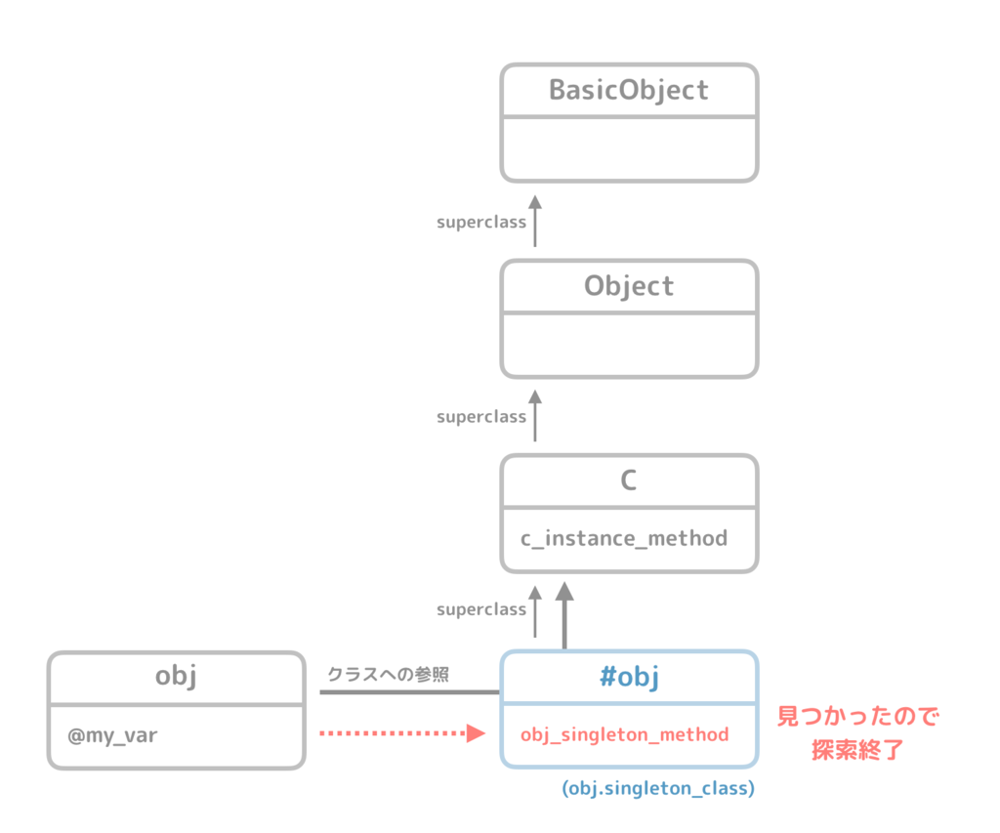
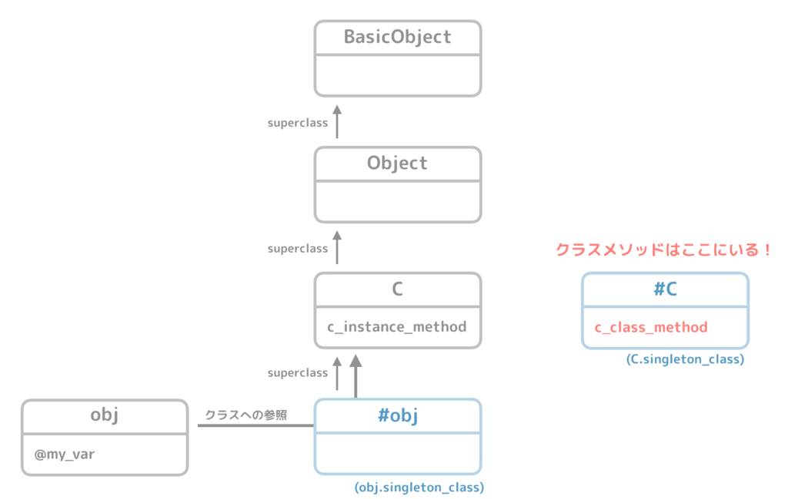

# Class - Ruby Tutorial
Ref: http://at-grandpa.hatenablog.jp/entry/2016/02/14/090544

## 目次
- [Class](#Class)
- [クラスメソッドとは](#クラスメソッドとは)
- [クラスメソッドはクラスの特異メソッド](#クラスメソッドはクラスの特異メソッド)
- [インスタンスメソッド](#インスタンスメソッド)
- [モジュール](#モジュール)
- [特異メソッドは特異クラスに属する](#特異メソッドは特異クラスに属する)
- [クラスメソッドはクラスの特異クラスに属していた](#クラスメソッドはクラスの特異クラスに属していた)

## Class
<a href="./1_class.rb">実行ファイル</a>  

RubyではクラスはClassクラスのオブジェクト。
```ruby
class A
  def say_hi
    puts "hi"
  end
end

a = A  # クラス自体がオブジェクトなので変数に代入できる
a_instance = a.new
a_instance.say_hi  # => hi

# 全てのクラスはClassクラスのオブジェクトなのでこのようになる
puts a_instance.class  # => A
puts A.class  # => Class
```


## クラスメソッドとは
`class << self`という謎な記法について。

## 特異メソッド
<a href="./2_singleton_method.rb">実行ファイル</a>  

特異メソッドはオブジェクト固有のメソッド。
同じクラスから生成された2つのオブジェクトのうち、片方のみで使えるメソッドを定義できる。

```ruby
class C
  def say_hi
    puts "hi"
  end
end

c_instance_1 = C.new
c_instance_2 = C.new

# インスタンスメソッドはどちらのインスタンスからも参照可能
c_instance_1.say_hi  # => hi
c_instance_2.say_hi  # => hi


# c_instance_1オブジェクトに特異メソッドを定義
def c_instance_1.say_hello
  "hello"
end

begin
  # 特異メソッドは定義したオブジェクトでのみ参照可能
  c_instance_1.say_hello  # => hello
  c_instance_2.say_hello  # => undefined method `say_hello' for #<C:0x00007f9b7b8685a8> (NoMethodError)
rescue => e
  puts e
end
```

## クラスメソッドはクラスの特異メソッド
<a href="./3_class_method.rb">実行ファイル</a>  

```ruby
class C
  def self.say_hi
    puts "hi"
  end
end

C.say_hi  # => hi
```

`class ... end`内では`self`はCクラス自体を参照するので、上記の`def self.say_hi`は`def C.say_hi`と同じ。  
つまり、クラスメソッドはこのように定義されるもの。

```ruby
class C
  def C.say_hi
    puts "hi"
  end
end
```

そこで先ほどの特異メソッドと見比べると、同じ記法であることがわかると思う。  
Rubyにおいて、クラスそのものがオブジェクトであることを考えると、クラスメソッドはCというクラス（Classクラスのオブジェクト）の特異メソッドだったことが分かる。

> メソッドはクラスに属している  

となると、特異メソッドはどこに存在するのか...?


## インスタンスメソッド
インスタンスメソッドはどこに属してあるか。
実はインスタンスではなくクラスに存在している。  
メソッド探索時にはオブジェクトのクラスにメソッドを探しにいきます（見つからなければ継承元を探しにいきます）。

- メソッドが見つからなければ、superclassをどんどん遡って探索
- メソッドが見つかれば、そのメソッドを実行する
- BasicObjectまで探しても見つからなければ NoMethodError

```ruby
class C
  def c_instance_method
    @my_var = 1
  end
end

obj = C.new

obj.c_instance_method

obj.missing_method  # => NoMethodError
```




## モジュール
### include
- includeしたモジュールは、includeしたクラスのすぐ一つ上に挿入される
- superclassの探索の前にモジュールが探索される

```ruby
module M
  def m_method
    "m_method"
  end
end

class C
  include M  # モジュールをinclude
  def c_instance_method
    @my_var = 1
  end
end

obj = C.new
obj.m_method # モジュールのメソッドを呼び出す
```


### prepend
- prependしたモジュールは、prependしたクラスのすぐ一つ下に挿入される

```ruby
module M
  def m_method
    "m_method"
  end
end

class C
  prepend M  # モジュールをprepend
  def c_instance_method
    @my_var = 1
  end
end

obj = C.new
obj.m_method # モジュールのメソッドを呼び出す
```



## 特異メソッドは特異クラスに属する
<a href="./4_singleton_method.rb">実行ファイル</a>  

- 実は、各オブジェクトは必ず一つの特異クラスを持っている
- 実は、メソッド探索では、特異クラスを一番最初に探索していた
  - 今までは特異クラスにメソッドが見つからなかったので素通りしていた
```ruby
class C
  def c_instance_method
    @my_var = 1
  end
end

obj = C.new

def obj.obj_singleton_method  # 特異メソッドを定義
  "obj_singleton_method"
end

puts obj.obj_singleton_method # => obj_singleton_method
```



- 特異メソッドは特異クラスに属する
  - obj.singleton_class.instance_methods(false) #=> [:obj_singleton_method]
- objの特異クラスのsuperclassは、オブジェクトの参照しているクラスである
  - obj.singleton_class.superclass #=> C
  - つまり、特異クラスにメソッドが見つからなければ、次の探索対象はオブジェクトの参照クラスである

```ruby
# singleton_classでそのオブジェクトの特異クラスを取得できる
puts obj.singleton_class.inspect  # => #<Class:#<C:0x00007fd46d884750>>

# 特異メソッド obj_singleton_method はクラスCには属さない
puts obj.class.instance_methods(false).inspect # => [:c_instance_method]

# 特異メソッド obj_singleton_method はobjの特異クラスに属する
puts obj.singleton_class.instance_methods(false).inspect # => [:obj_singleton_method]

# 特異クラスのsuperclassは、オブジェクトの参照しているクラスであるC
puts obj.singleton_class.superclass.inspect # => C
```

## クラスメソッドはクラスの特異クラスに属していた
<a href="./5_class_method.rb">実行ファイル</a>  

```ruby
class C
  def self.c_class_method  # クラスメソッド
    "c_class_method"
  end
end

puts C.c_class_method  # => c_class_method

# クラスメソッドはCの特異クラスに属している
puts C.singleton_class.instance_methods(false).inspect  # => [:c_class_method]
```


